# Ficket - 얼굴 인식 기반 티켓팅 플랫폼

## 1. 프로젝트 소개 🚀

Ficket은 얼굴 인식을 활용한 티켓 예매 및 검증 서비스입니다.
사용자는 티켓 예매 시 얼굴 정보를 등록하고, 입장 시 얼굴 인식만으로 빠르고 안전하게 검증을 완료할 수 있습니다.
별도의 실물 티켓이나 추가 인증 없이 간편하게 이용할 수 있으며, 실시간 검증 시스템을 통해 원활한 이벤트 운영을 지원합니다.

[Ficket 바로 가기](https://ficket.shop)

---

## 2. 기획 및 설계 💡

### 프로젝트 명세

https://www.notion.so/Ficket-125cb8b3a5cf80f5966bd3497a28b95d?pvs=4

### 와이어 프레임 & 화면 설계

https://www.figma.com/design/M9VDb3yhlblGtRa8O3DfQr/Ficket?node-id=9-1722&t=qpZDQ4gt0FRLL1xA-1

---

## 3. 제작기간 && 팀원소개 🏃‍🏃‍♀️💨

### 2024-11-21 ~ 2024-02-25🔥

| 이름                                 | 담당 기능                                                                   |
|------------------------------------|-------------------------------------------------------------------------|
| [최용수](https://github.com/TutiTuti) | Jenkins, CI/CD, OAuth2 인증/인가, 정산, 메인페이지, 티켓 검사, 회원 관리, 날짜 선택, 공연 조회 등   |
| [오형상](https://github.com/ohy1023)  | MSA 구성, 좌석 선점, 얼굴 인식, 랭킹, 대기열, Locust 부하 테스트 ,PortOne 결제, 마이티켓, 공연 관리 등 |

---

## 4. 🛠 기술 스택

  <h3>🎨 FrontEnd</h3>
  

    
    
    
    
     
    
    
    
     
    
    
  

  <h3>⚙ BackEnd</h3>
  

    
    
    
    
     
    
    
    
    
    
    
     
    
    
    
    
    
    
  

  <h3>💾 Database & Caching</h3>
  

    
    
    
    
  

  <h3>🏠 Cloud & Infrastructure</h3>
  

    
    
    
    
    
  

  <h3>✉ Event Streaming</h3>
  

    
    
  

  <h3>🛠️ Monitoring & Logging</h3>
  

    
    
    
  

  <h3>🎮 Performance Testing & Load Testing</h3>
  

    
  

  <h3>💬 Cooperation</h3>
  

    
    
    
    
    
  

---

## 5. 아키텍처 📃

---

## 6. API 명세서 📡

- Swagger: [https://api.ficket.shop](https://api.ficket.shop)
- Notion: [API 명세서 바로가기](https://www.notion.so/API-125cb8b3a5cf81dbbff3cec772823e6a?pvs=4)

---

## 7. ERD 🗄️

---

## 8. 서비스 화면 (PC) 🖥️

1. 메인 페이지

   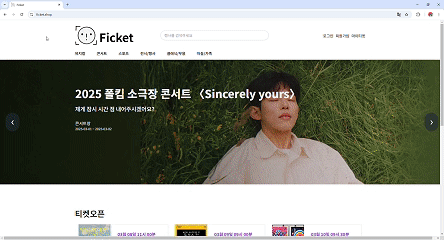  

2. 공연 상세 페이지

   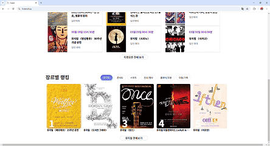  

3. 티켓팅

   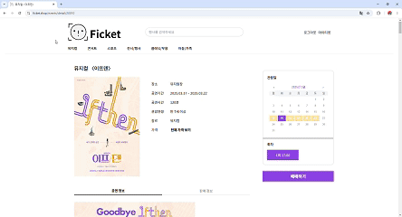  

4. 마이 티켓

  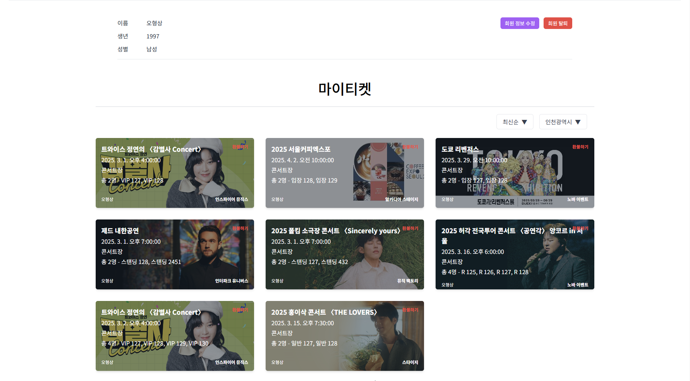  

5. 오픈 티켓

  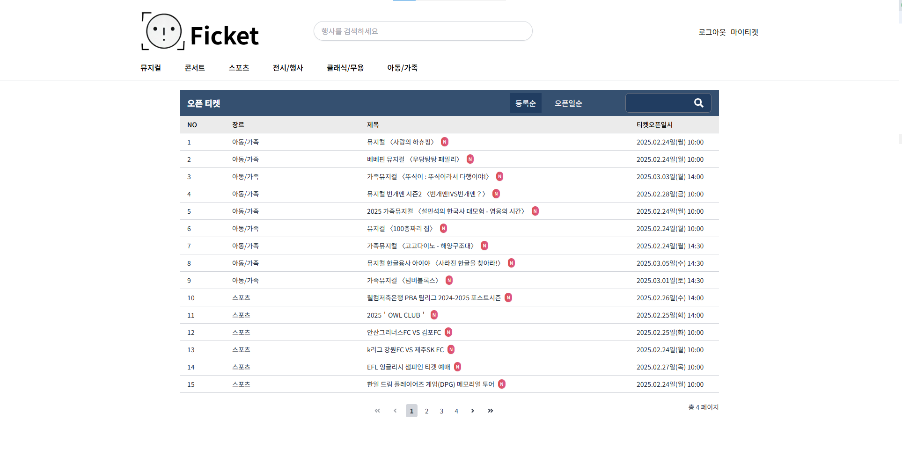  

6. 장르별 랭킹

    

7. 검색 (자동 완성)

    

8. 검색 결과

  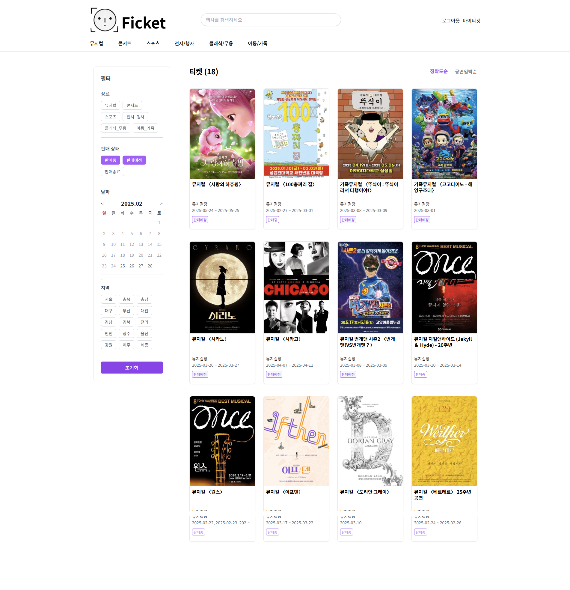  

9. 관리자 로그인

  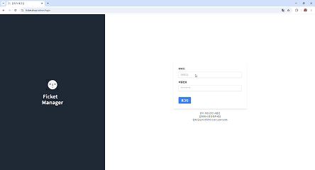  

10. 공연 등록 (관리자)

  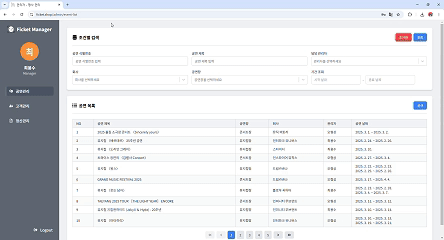  
    

11. 임시 URL 발급 (관리자)

  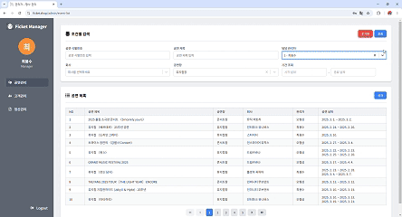  

12. 티켓 검사 (관리자 & 고객)

<table>
  <td>
    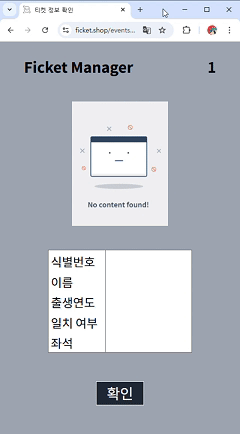 
  </td>
  <td>
    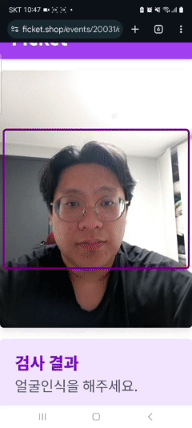
  </td>
</table>

---

## 9. 서비스 화면 (MOBILE) 📱

<table style="border: 2px; text-align:center;">
  <tr style="text-align:center;">
    <td> 로그인 </td>
    <td> 메인 페이지 </td>
    <td> 공연 상세 </td>
  </tr>
  <tr>
    <td>
      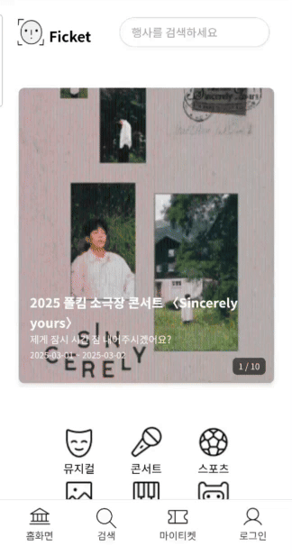
    </td>
    <td>
      
    </td>
    <td>
      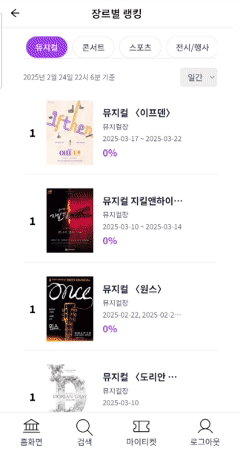
    </td>
  </tr>
</table>

 

<table style="border: 2px; text-align:center;">
  <tr style="text-align:center;">
    <td> 티켓팅 </td>
    <td> 장르별 랭킹 </td>
    <td> 오픈 티켓 </td>
  </tr>
  <tr>
    <td>
      
    </td>
    <td>
      
    </td>
    <td>
      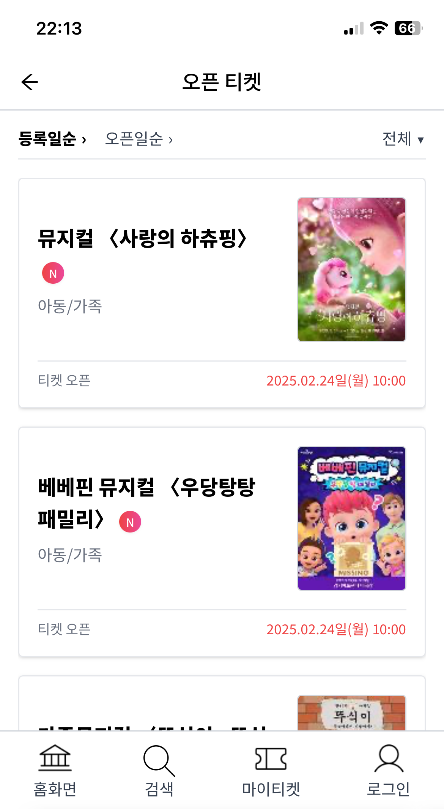
    </td>
  </tr>
</table>

---

## 10. 주요 기술 ✨

- 프론트
    - [zustand를 활용한 로그인 정보 유지](https://tutic982.tistory.com/3)
    - [반응형 처리하기](https://velog.io/@zvyg1023/React-%EB%B0%98%EC%9D%91%ED%98%95-%EC%B2%98%EB%A6%AC%ED%95%98%EA%B8%B0-w.-react-responsive)
- Docker
    - [도커 spring 서버 올리기](https://tutic982.tistory.com/2)
- Jenkins
    - [?? - 아직 작성 안됨]()
- MSA
    - [Eureka Server & Eureka Client & Gateway 설정](https://velog.io/@zvyg1023/MSA-%EA%B5%AC%EC%B6%95-1-Eureka-Server-Eureka-Client-Gateway-%EC%84%A4%EC%A0%95)
    - [인증/인가 설정](https://velog.io/@zvyg1023/MSA-%EA%B5%AC%EC%B6%95-2-%EC%9D%B8%EC%A6%9D%EC%9D%B8%EA%B0%80-%EC%84%A4%EC%A0%95)
    - [Config 서버 구축](https://velog.io/@zvyg1023/MSA-%EA%B5%AC%EC%B6%95-3-Config-%EC%84%9C%EB%B2%84-%EA%B5%AC%EC%B6%95)
    - [Spring Cloud Bus와 RabbitMQ를 활용한 Config 변경 자동 반영 설정](https://velog.io/@zvyg1023/MSA-%EA%B5%AC%EC%B6%95-4-Spring-Cloud-Bus%EC%99%80-RabbitMQ%EB%A5%BC-%ED%99%9C%EC%9A%A9%ED%95%9C-Config-%EB%B3%80%EA%B2%BD-%EC%9E%90%EB%8F%99-%EB%B0%98%EC%98%81-%EC%84%A4%EC%A0%95)
    - [설정 파일의 암호화 처리 : 비대칭키를 이용한 암/복호화](https://velog.io/@zvyg1023/MSA-%EA%B5%AC%EC%B6%95-5-%EC%84%A4%EC%A0%95-%ED%8C%8C%EC%9D%BC%EC%9D%98-%EC%95%94%ED%98%B8%ED%99%94-%EC%B2%98%EB%A6%AC-%EB%B9%84%EB%8C%80%EC%B9%AD%ED%82%A4%EB%A5%BC-%EC%9D%B4%EC%9A%A9%ED%95%9C-%EC%95%94%EB%B3%B5%ED%98%B8%ED%99%94)
    - [Config 서버와 클라이언트에서 공개키와 개인키를 활용한 암호화/복호화 설정](https://velog.io/@zvyg1023/MSA-%EA%B5%AC%EC%B6%95-7-Config-%EC%84%9C%EB%B2%84%EC%99%80-%ED%81%B4%EB%9D%BC%EC%9D%B4%EC%96%B8%ED%8A%B8%EC%97%90%EC%84%9C-%EA%B3%B5%EA%B0%9C%ED%82%A4%EC%99%80-%EA%B0%9C%EC%9D%B8%ED%82%A4%EB%A5%BC-%ED%99%9C%EC%9A%A9%ED%95%9C-%EC%95%94%ED%98%B8%ED%99%94%EB%B3%B5%ED%98%B8%ED%99%94-%EC%84%A4%EC%A0%95)
    - [Feign Client를 활용한 서버간 동기 통신](https://velog.io/@zvyg1023/MSA-%EA%B5%AC%EC%B6%95-9-Feign-Client-%EC%84%9C%EB%B2%84%EA%B0%84-%ED%86%B5%EC%8B%A0-%ED%95%98%EA%B8%B0)
    - [서비스 장애 대응 Circuit Breaker 구현(feat. Resilience4J)](https://velog.io/@zvyg1023/MSA-%EA%B5%AC%EC%B6%95-10-%EC%84%9C%EB%B9%84%EC%8A%A4-%EC%9E%A5%EC%95%A0-%EB%8C%80%EC%9D%91-Circuit-Breaker-%EA%B5%AC%ED%98%84feat.-Resilience4J)
- 대기열
    - [대기열 설계](https://velog.io/@zvyg1023/%ED%8B%B0%EC%BC%93%ED%8C%85-%EC%84%9C%EB%B9%84%EC%8A%A4-%EC%84%A4%EA%B3%84)
    - [Kafka, Redis, WebSocket, WebFlux를 활용한 대기열 구현](https://velog.io/@zvyg1023/%EB%8C%80%EA%B8%B0%EC%97%B4-%EA%B5%AC%ED%98%84-2-Kafka-Redis-WebSocket-WebFlux%EB%A5%BC-%ED%99%9C%EC%9A%A9%ED%95%9C-%EB%8C%80%EA%B8%B0%EC%97%B4-%EA%B4%80%EB%A6%AC)
    - [Locust를 활용한 부하 테스트](https://github.com/ohy1023/ficket-ticketing-locust)
- 얼굴 인식
    - [Flask, Eureka, Spring Config, RabbitMQ 통합](https://velog.io/@zvyg1023/MSA-%EA%B5%AC%EC%B6%95-8-Flask-Eureka-Spring-Config-RabbitMQ-%ED%86%B5%ED%95%A9)
    - [이미지 암호화를 위한 S3 SSE-KMS 적용](https://velog.io/@zvyg1023/S3-SSE-KMS-%EC%A0%81%EC%9A%A9%ED%95%98%EA%B8%B0)
    - [Insightface를 활용한 얼굴 인식 개발](https://velog.io/@zvyg1023/Insightface%EB%A5%BC-%ED%99%9C%EC%9A%A9%ED%95%9C-%EC%96%BC%EA%B5%B4-%EC%9D%B8%EC%8B%9D)
- 정산
    - [spring batch를 이용한 정산](https://tutic982.tistory.com/4)
- 티켓 검사
    - [??]()
- 검색
    - [Elasticsearch Indexing 설계](https://velog.io/@zvyg1023/%EC%97%98%EB%9D%BC%EC%8A%A4%ED%8B%B1-%EC%84%9C%EC%B9%98-%EA%B2%80%EC%83%89-%EA%B5%AC%ED%98%84-1-%EC%83%89%EC%9D%B8-%EC%8B%9C%EC%8A%A4%ED%85%9C-%EC%84%A4%EA%B3%84)
    - [Elasticsearch 8.13.4, Kibana 설치 및 S3 연결 (docker-compose)](https://velog.io/@zvyg1023/%EC%97%98%EB%9D%BC%EC%8A%A4%ED%8B%B1-%EC%84%9C%EC%B9%98-%EA%B2%80%EC%83%89-%EA%B5%AC%ED%98%84-2-Elasticsearch-8.13.4-Kibana-%EC%84%A4%EC%B9%98-%EB%B0%8F-S3-%EC%97%B0%EA%B2%B0-docker-compose)
    - [전체 색인 구현 (Event)](https://velog.io/@zvyg1023/%EC%97%98%EB%9D%BC%EC%8A%A4%ED%8B%B1-%EC%84%9C%EC%B9%98-%EA%B2%80%EC%83%89-%EA%B5%AC%ED%98%84-3-%EC%A0%84%EC%B2%B4-%EC%83%89%EC%9D%B8-%EA%B5%AC%ED%98%84-Search-%EC%84%9C%EB%B2%84)
    - [전체 색인 구현 (Search)](https://velog.io/@zvyg1023/%EC%97%98%EB%9D%BC%EC%8A%A4%ED%8B%B1-%EC%84%9C%EC%B9%98-%EA%B2%80%EC%83%89-%EA%B5%AC%ED%98%84-4-%EC%A0%84%EC%B2%B4-%EC%83%89%EC%9D%B8-%EA%B5%AC%ED%98%84-Search-%EC%84%9C%EB%B2%84)
    - [부분 색인 구현](https://velog.io/@zvyg1023/%EC%97%98%EB%9D%BC%EC%8A%A4%ED%8B%B1-%EC%84%9C%EC%B9%98-%EA%B2%80%EC%83%89-%EA%B5%AC%ED%98%84-5-%EB%B6%80%EB%B6%84-%EC%83%89%EC%9D%B8-%EA%B5%AC%ED%98%84)
    - [검색 기능 구현](https://velog.io/@zvyg1023/%EC%97%98%EB%9D%BC%EC%8A%A4%ED%8B%B1-%EC%84%9C%EC%B9%98-%EA%B2%80%EC%83%89-%EA%B5%AC%ED%98%84-6-%EA%B2%80%EC%83%89-%EA%B8%B0%EB%8A%A5-%EA%B5%AC%ED%98%84)
- 기타
    - [OAuth + JWT + Redis를 이용한 카카오 로그인- 아직 작성 안됨]()
    - [AWS Lambda를 이용해 이미지 리사이징 적용 - 이미지 로딩 속도 최적화](https://velog.io/@zvyg1023/AWS-Lambda%EB%A5%BC-%EC%9D%B4%EC%9A%A9%ED%95%B4-%EC%9D%B4%EB%AF%B8%EC%A7%80-%EB%A6%AC%EC%82%AC%EC%9D%B4%EC%A7%95-%EC%A0%81%EC%9A%A9-%EC%9D%B4%EB%AF%B8%EC%A7%80-%EB%A1%9C%EB%94%A9-%EC%86%8D%EB%8F%84-%EC%B5%9C%EC%A0%81%ED%99%94)
    - [Redis(Redisson) 분산락을 활용한 좌석 선점](https://velog.io/@zvyg1023/Spring-RedisRedisson-%EB%B6%84%EC%82%B0%EB%9D%BD%EC%9D%84-%ED%99%9C%EC%9A%A9%ED%95%9C-%EC%A2%8C%EC%84%9D-%EC%84%A0%EC%A0%90-%EA%B0%9C%EB%B0%9C)
    - [Redis로 조회수 랭킹 시스템 구현](https://velog.io/@zvyg1023/Spring-Redis%EB%A1%9C-%EC%A1%B0%ED%9A%8C%EC%88%98-%EB%9E%AD%ED%82%B9-%EC%8B%9C%EC%8A%A4%ED%85%9C-%EA%B5%AC%ED%98%84%ED%95%98%EA%B8%B0)
    - [Redis 예매율 순위 시스템 구현](https://velog.io/@zvyg1023/Spring-Redis-%EC%98%88%EB%A7%A4%EC%9C%A8-%EC%88%9C%EC%9C%84-%EC%8B%9C%EC%8A%A4%ED%85%9C-%EA%B5%AC%ED%98%84)
    - [포트원 연동을 통한 결제 시스템](https://velog.io/@zvyg1023/%ED%8F%AC%ED%8A%B8%EC%9B%90%EC%9D%84-%EC%9D%B4%EC%9A%A9%ED%95%9C-%EC%B9%B4%EC%B9%B4%EC%98%A4%ED%8E%98%EC%9D%B4-%EA%B2%B0%EC%A0%9C-%EC%97%B0%EB%8F%99-API-V2-Webhook-V2)

--- 

## 11. Trouble Shooting 🚧

- [Config 서버 설정 값 노출](https://velog.io/@zvyg1023/MSA-%EA%B5%AC%EC%B6%95-6-%EC%95%94%ED%98%B8%ED%99%94%EB%90%9C-%EC%84%A4%EC%A0%95-%ED%8C%8C%EC%9D%BC-%EB%B3%B4%ED%98%B8%EC%99%80-decrypt-API-%EC%A0%91%EA%B7%BC-%EC%A0%9C%EC%96%B4)

- [Config 서버 복호화 실패](https://velog.io/@zvyg1023/MSA-%EA%B5%AC%EC%B6%95-7-Config-%EC%84%9C%EB%B2%84%EC%99%80-%ED%81%B4%EB%9D%BC%EC%9D%B4%EC%96%B8%ED%8A%B8%EC%97%90%EC%84%9C-%EA%B3%B5%EA%B0%9C%ED%82%A4%EC%99%80-%EA%B0%9C%EC%9D%B8%ED%82%A4%EB%A5%BC-%ED%99%9C%EC%9A%A9%ED%95%9C-%EC%95%94%ED%98%B8%ED%99%94%EB%B3%B5%ED%98%B8%ED%99%94-%EC%84%A4%EC%A0%95)

- [배포 시 Java가 ElasticSearch Self-signed SSL 인식 하지 못하는 문제](https://velog.io/@zvyg1023/Docker-%EB%B0%B0%ED%8F%AC-%EC%8B%9C-Elasticsearch-SSL-%EC%9D%B8%EC%A6%9D-%EB%AC%B8%EC%A0%9C-%ED%95%B4%EA%B2%B0)

- [XSS 방어: OWASP AntiSamy와 DOMPurify를 활용한 TinyMCE 보안 강화](https://velog.io/@zvyg1023/XSS-%EB%B0%A9%EC%96%B4-OWASP-AntiSamy%EC%99%80-DOMPurify%EB%A5%BC-%ED%99%9C%EC%9A%A9%ED%95%9C-TinyMCE-%EB%B3%B4%EC%95%88-%EA%B0%95%ED%99%94)

---

## 12. 외부 리소스 정보 📁

[포트원 개발자 센터](https://developers.portone.io/opi/ko/readme?v=v2)
 
[카카오 디벨로퍼](https://developers.kakao.com/)
